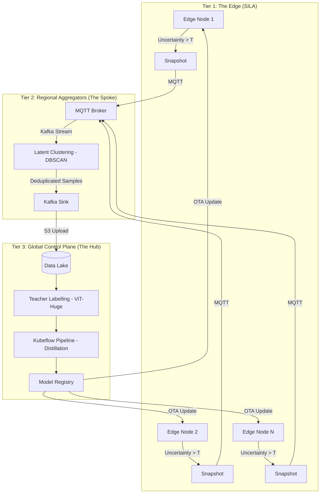

# ☸️ MAHORAGA: Self-Adaptive ML Orchestration

[]()
[]()
[]()

> *"With this treasure, I summon..."*

**MAHORAGA** (**M**odel **A**daptive **H**ybrid **O**rchestrator for **R**egional **A**ggregation & **G**lobal **A**daptation) is an enterprise-scale control plane designed to manage, monitor, and evolve distributed Machine Learning models across thousands of edge devices.

Inspired by the "Eight-Handled Sword Divergent Sila Divine General Mahoraga" from Jujutsu Kaisen, this project implements the **DHARMA Wheel**—a self-healing mechanism that allows a fleet of AI models to "adapt to any and all phenomena" (data drift) encountered in the field.

---

## 🎭 The Lore of Adaptation

In JJK, Mahoraga adapts to any attack after the **Dharma Wheel** clicks. In this system, we mirror that cycle:

1.  **The Divergent Sila (Edge):** Edge devices perform **S**calable **I**nference & **L**atent **A**nalysis. When a model encounter OOD (Out-of-Distribution) data, it "clicks."
2.  **The Wheel Click (Spoke):** Regional aggregators group similar failures using latent clustering.
3.  **The Adaptation (Hub):** A global control plane triggers automated re-distillation via Kubeflow.
4.  **The Resolution (OTA):** Updated models are rolled out via an **Eight-Handled Phased Rollout**.

---

## 🏗️ Architecture: The Three-Tier Hierarchy

Mahoraga is built on a distributed **Hub-and-Spoke** topology to handle 10,000+ nodes.



---

## 🛠️ Tech Stack: The Divine Artifacts

-   **D.H.A.R.M.A. Wheel:** **D**istributed **H**euristic **A**daptive **R**e-training **M**anagement **A**rchitecture.
-   **Messaging:** Apache Kafka (High-throughput), Mosquitto MQTT (Lightweight Edge).
-   **Orchestration:** Kubeflow Pipelines (KFP), FastAPI.
-   **Storage:** MinIO / AWS S3.
-   **Clustering:** Scikit-Learn (DBSCAN) for latent space de-duplication.
-   **Deployment:** Docker, Kubernetes (Helm).

---

## 📂 Project Structure

```text
mahoraga/
├── api/            # Pydantic schemas & Protobuf definitions
├── edge/           # Edge integration & Mock client (SILA Implementation)
├── spoke/          # Regional Aggregators (MQTT -> Kafka Bridge)
│   ├── clustering/ # DBSCAN latent clustering logic (The Wheel Click)
│   └── gateway/    # Messaging bridge
├── hub/            # Global Control Plane (Kubeflow & OTA Orchestrator)
├── infra/          # Docker Compose & K8s Manifests
├── shared/         # Common utilities (Logging, Config, Models)
└── Makefile        # The Ritual of Commands
```

---

## 🚀 The Ritual: Getting Started

### 1. Summon the Infrastructure
Start the Kafka and MQTT brokers:
```bash
make infra-up
```

### 2. Prepare the Spoke (Regional Aggregator)
Start the gateway and clustering processor:
```bash
make spoke
make cluster
```

### 3. Invoke the Hub (Control Plane)
Launch the global sample collector and OTA orchestrator:
```bash
make hub
make ota
```

---

## 🔄 The Eight-Handled Rollout

To ensure fleet safety, Mahoraga employs a phased deployment strategy:

| Stage | Impact | Description |
| :--- | :--- | :--- |
| **Shadow Mode** | 0% | Model runs in background; output logged but not used. |
| **Canary Release** | 1% | Deployed to a small, diverse subset of nodes. |
| **Telemetry Gate** | 1% | 24-hour monitoring for latency/crash spikes. |
| **Phased Expansion** | 10% → 100% | Gradual rollout with automated rollback triggers. |

---

## 🖼️ Visualizing the Adaptation


*Mahoraga adapting to the environment—just as your models adapt to the edge.*

---

## 📜 License
This project is licensed under the **Sila Divine License**. Use responsibly to conquer model drift.

---
*Developed by [JakkalaNagaVamsiKrishna](https://github.com/JakkalaNagaVamsiKrishna)*
