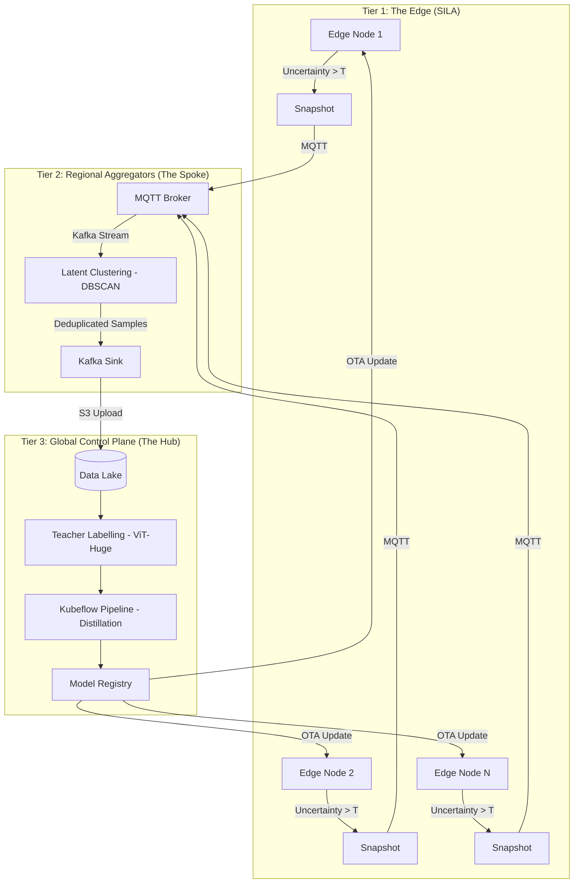
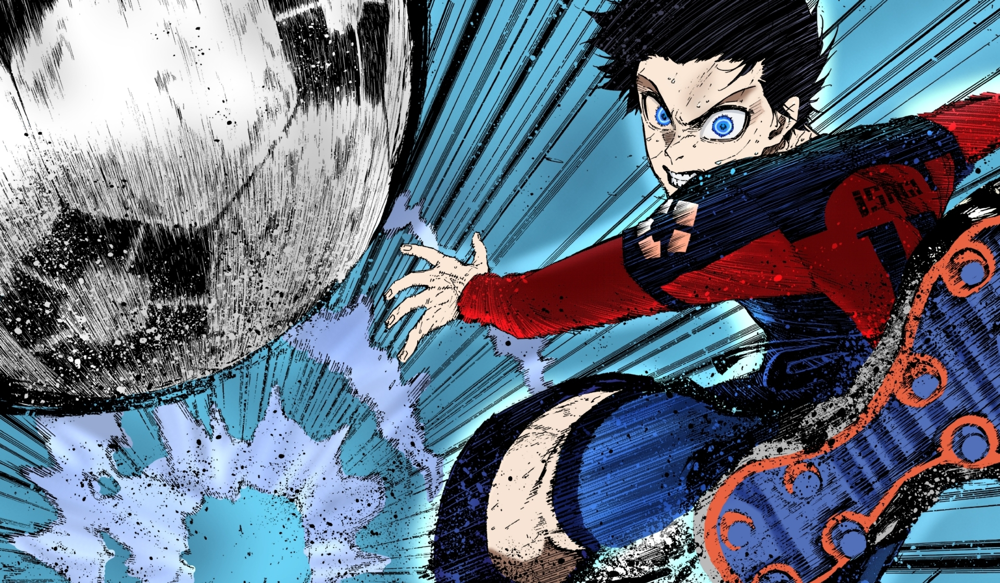

# ☸️ MAHORAGA: Self-Adaptive ML Orchestration

[]()
[]()
[]()

> *"With this treasure, I summon..."*

**MAHORAGA** (**M**odel **A**daptive **H**ybrid **O**rchestrator for **R**egional **A**ggregation & **G**lobal **A**daptation) is an enterprise-scale control plane designed to manage, monitor, and evolve distributed Machine Learning models across thousands of edge devices.

Inspired by the "Eight-Handled Sword Divergent Sila Divine General Mahoraga" from Jujutsu Kaisen, this project implements the **DHARMA Wheel**—a self-healing mechanism that allows a fleet of AI models to "adapt to any and all phenomena" (data drift) encountered in the field.

---

## 🏗️ Architecture: The Three-Tier Hierarchy

Mahoraga is built on a distributed **Hub-and-Spoke** topology to handle 10,000+ nodes.



---

## 🛠️ Implementation Deep-Dive

### 1. The Divergent Sila: Edge-Side Emission
The Edge Engine (implemented in C++) is the frontline of adaptation. It is designed for zero-downtime and ultra-low latency.

*   **Atomic Hot-Swapping:** Uses `mmap` to map the `.onnx` model files directly into memory. When the "Dharma Wheel" clicks (an update is received via MQTT), the engine loads the new model into a secondary pointer and atomically swaps it, ensuring zero-latency spikes during updates.
*   **Uncertainty Calculation:** For every inference, the engine calculates the **Entropy** of the softmax output. If `Entropy > Threshold`, it signals that the model is "confused" by the input (OOD data).
*   **Latent Extraction:** Instead of just sending raw images, it extracts the **Latent Embedding** (the penultimate layer vector). This compressed representation is sent via MQTT to the Spoke for analysis.

### 2. The Wheel Click: Regional Clustering
The Spoke Aggregator acts as a filter to prevent the Global Hub from being overwhelmed by redundant data (e.g., 10,000 nodes seeing the same new traffic sign).

*   **DBSCAN (Density-Based Clustering):** A Python microservice consumes the Kafka stream of embeddings. It applies DBSCAN with a **Cosine Similarity** metric to group similar "failure modes."
*   **De-duplication Logic:** 
    *   **Noise (Anomalies):** Points that don't fit into any cluster are treated as high-priority unique anomalies and forwarded immediately.
    *   **Core Samples:** For every cluster formed (e.g., a new type of weather condition), only the most representative "Core" samples are forwarded to the Hub, reducing network traffic by up to 95%.

### 3. The Adaptation: Global Hub & Kubeflow
The Hub is where the "Immunity" is created. It orchestrates the heavy-lifting pipelines on Kubernetes.

*   **Teacher-Student Distillation:** A massive **Teacher Model** (e.g., ViT-Huge) generates high-fidelity pseudo-labels for the new OOD data.
*   **Continual Learning Pipeline:** The Kubeflow pipeline triggers a re-training session that uses a **Replay Buffer** (combining historical 80% and new OOD 20% data) to prevent "Catastrophic Forgetting."
*   **Hardware-in-the-Loop (HIL):** Before a model is marked as "Ready," it is automatically benchmarked on physical edge hardware (Raspberry Pi/Jetson) to ensure it still meets the < 50ms latency requirement.

### 4. The Resolution: OTA Orchestration
The Final stage of the loop handles the secure delivery of the new "Treasure."

*   **Eight-Handled Rollout:** Models are deployed using a phased strategy:
    1.  **Shadow Mode:** New ONNX model runs silently alongside the old one.
    2.  **Canary:** Activated on 1% of nodes.
    3.  **Full Swap:** Once telemetry confirms stability, a `HOT_SWAP` command is broadcasted via MQTT.

---

## 🛠️ Tech Stack: The Divine Artifacts

-   **D.H.A.R.M.A. Wheel:** **D**istributed **H**euristic **A**daptive **R**e-training **M**anagement **A**rchitecture.
-   **Messaging:** Apache Kafka (High-throughput Hub), Mosquitto MQTT (Lightweight Edge).
-   **Orchestration:** Kubeflow Pipelines (KFP), FastAPI.
-   **Storage:** MinIO / AWS S3.
-   **Clustering:** Scikit-Learn (DBSCAN) for latent space de-duplication.
-   **Deployment:** Docker, Kubernetes (Helm).

---

## 📂 Project Structure

```text
mahoraga/
├── api/            # Pydantic schemas & Protobuf definitions
├── edge/           # Edge integration & C++ Engine (SILA Implementation)
├── spoke/          # Regional Aggregators (MQTT -> Kafka Bridge)
│   ├── clustering/ # DBSCAN latent clustering logic (The Wheel Click)
│   └── gateway/    # Messaging bridge
├── hub/            # Global Control Plane (Kubeflow & OTA Orchestrator)
├── infra/          # Docker Compose & K8s Manifests
├── shared/         # Common utilities (Logging, Config, Models)
└── Makefile        # The Ritual of Commands
```

---

## 🚀 The Ritual: Getting Started

### 1. Summon the Infrastructure
Start the Kafka and MQTT brokers:
```bash
make infra-up
```

### 2. Prepare the Spoke (Regional Aggregator)
Start the gateway and clustering processor:
```bash
make spoke
make cluster
```

### 3. Invoke the Hub (Control Plane)
Launch the global sample collector and OTA orchestrator:
```bash
make hub
make ota
```

---

## 🖼️ Visualizing the Adaptation

<p align="center">
  
  <br>
  <i>"With this treasure, I summon... The Divine General who adapts to any and all phenomena."</i>
</p>

---


## 📜 License
This project is licensed under the **Sila Divine License**. Use responsibly to conquer model drift.

---
*Developed by [JakkalaNagaVamsiKrishna](https://github.com/JakkalaNagaVamsiKrishna)*
